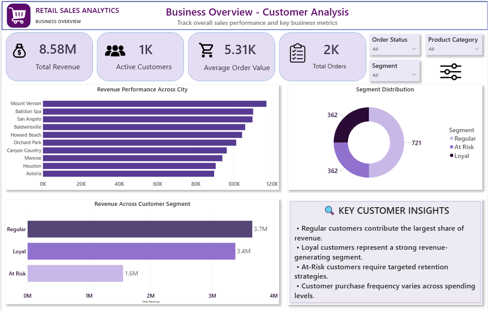

<!-- ====================================================== -->
<!--                     HERO HEADER                        -->
<!-- ====================================================== -->

 

<!-- ====================================================== -->
<!--                  CONTACT INFORMATION                   -->
<!-- ====================================================== -->

<table align="center">
<tr>

<td align="center">

</td>

<td>&nbsp;&nbsp;&nbsp;</td>

<td align="center">

</td>

<td>&nbsp;&nbsp;&nbsp;</td>

<td align="center">

</td>

</tr>
</table>

 

---

# 👩🏻‍💻 About Me

<table>
<tr>

<td width="58%" valign="middle">

### Hi, I'm Sri! 👋

I'm a **Data Analyst** with a background in **M.Sc. Software Systems**, passionate about transforming raw and messy data into meaningful business insights.

My typical analytics workflow is:

**Raw Data → Cleaning → SQL → Python → EDA → Visualization → Insights**

### 🔍 What I Work With

🧹 Data Cleaning & Preparation  
🗄️ SQL Data Extraction & Analysis  
🐍 Python & Pandas EDA  
📊 KPI & Business Analysis  
📈 Power BI Dashboard Development  
👥 Customer & Sales Analytics

### 🎯 Current Focus

Building **end-to-end analytics projects** while strengthening SQL, Python, Power BI and data storytelling.

</td>

<td width="42%" align="center">

</td>

</tr>
</table>

---

# 🛠️ Tech Stack

<!-- ONE HORIZONTAL TECH STACK -->

<table>
<tr>

<td align="center">

 
<b>Python</b>
</td>

<td width="18">&nbsp;</td>

<td align="center">

 
Data Analysis
</td>

<td width="18">&nbsp;</td>

<td align="center">

 
<b>MySQL</b>
</td>

<td width="18">&nbsp;</td>

<td align="center">

 
Analysis
</td>

<td width="18">&nbsp;</td>

<td align="center">

 
Dashboards
</td>

<td width="18">&nbsp;</td>

<td align="center">

 
Analytics
</td>

<td width="18">&nbsp;</td>

<td align="center">

 
Reporting
</td>

<td width="18">&nbsp;</td>

<td align="center">

 
Visualization
</td>

<td width="18">&nbsp;</td>

<td align="center">

 
Visualization
</td>

</tr>
</table>

 

---

# 🚀 Featured Projects

### Turning datasets into stories, dashboards & decisions 📊

---

## 🛒 01 — Amazon Fresh Sales Analysis

<table>
<tr>

<td width="54%" valign="middle">

### MySQL · SQL · Power BI

**E-commerce Sales & Inventory Analytics**

Designed a normalized relational e-commerce database and performed SQL analysis across sales, customers, products, suppliers, revenue and inventory.

**Key Work**

• ER modeling & 3NF normalization  
• Primary & Foreign Keys  
• DDL, DML & constraints  
• JOINs & subqueries  
• Aggregate functions  
• Sales & inventory analysis  
• Business reporting

 

</td>

<td width="46%" align="center">

</td>

</tr>
</table>

---

## 🎬 02 — Netflix Data Analysis

<table>
<tr>

<td width="46%" align="center">

</td>

<td width="54%" valign="middle">

### Power BI · DAX

**Netflix Content Trends & Performance Analysis**

Cleaned and transformed Netflix data to analyze content trends across genres, countries, ratings and time periods.

**Key Work**

• Data cleaning & transformation  
• Missing-value handling  
• Date & rating standardization  
• Genre & country analysis  
• DAX analysis  
• KPI development  
• Interactive dashboard  
• Maps & slicers

 

</td>

</tr>
</table>

---

## 🏪 03 — Retail Sales Analytics

<table>
<tr>

<td width="54%" valign="middle">

### Excel · MySQL · Python · Power BI

**End-to-End Retail Sales & Customer Analytics**

Performed data cleaning, SQL analysis and Python-based EDA across sales, customers, stores, products, staff and inventory.

**Key Work**

• Excel data cleaning  
• SQL business analysis  
• Python/Pandas EDA  
• RFM customer segmentation  
• Sales & store analysis  
• Inventory analysis  
• Power BI dashboard  
• KPIs, slicers & bookmarks

 

</td>

<td width="46%" align="center">

</td>

</tr>
</table>

---

## 🏭 04 — Manufacturing Production & Downtime Analysis

  

### Python · Pandas · MySQL · SQL · Power BI

**Production Performance · Downtime · Defects · Quality · Maintenance**

An upcoming end-to-end analytics project focused on manufacturing production efficiency, downtime patterns, defect analysis, quality performance and maintenance operations.

---

# 📈 GitHub Activity

  

---

# 📚 Currently Learning

<table>
<tr>

<td width="220" align="center">

### 📊 POWER BI

**Advanced DAX**

Data Storytelling  
Dashboard Design

</td>

<td width="20"></td>

<td width="220" align="center">

### 🐍 PYTHON

**Statistical EDA**

Advanced Pandas  
Data Analysis

</td>

<td width="20"></td>

<td width="220" align="center">

### 🗄️ SQL

**Advanced Queries**

Analytical SQL  
Data Extraction

</td>

<td width="20"></td>

<td width="220" align="center">

### 🤖 GENAI

**Prompt Engineering**

AI-assisted Analytics  
Productivity

</td>

</tr>
</table>

# 🎓 Education & Certifications

### 🎓 M.Sc. Software Systems

**KG College of Arts and Science · 87%**

 

&nbsp;

---

# 👥 Leadership

### Student Secretary

**Department of Software Systems & Computer Science (PG)**

Organized inter-departmental competitions involving **50+ students** and coordinated communication between faculty and students to support smooth event execution.

---

# 💡 What I Bring

---

 

## 💭 My Analytics Philosophy

### *"Every dataset has a story — I just query it out."* 📊

 

  

&nbsp;&nbsp;&nbsp;

  

